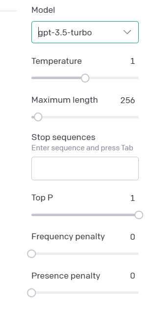
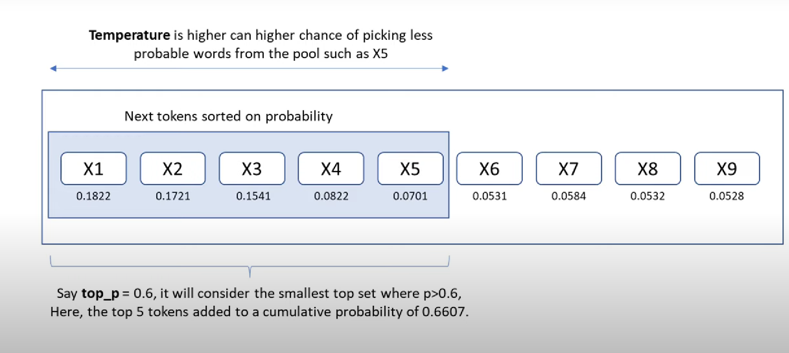
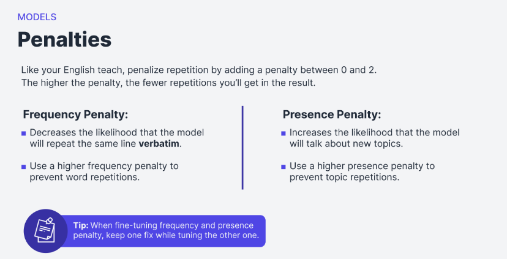

<!-- TOC -->

- [Gen-AI Lifecycle](#gen-ai-lifecycle)
- [Transformers](#transformers)
    - [Transformers model key-highlights](#transformers-model-key-highlights)
        - [Transformer](#transformer)
        - [Simplified Transformer architecture](#simplified-transformer-architecture)
- [In-depth Understanding of Transformer architecture step by step](#in-depth-understanding-of-transformer-architecture-step-by-step)
    - [Types of transformer models](#types-of-transformer-models)
- [HistoryEvolution tree of LLM models](#historyevolution-tree-of-llm-models)
- [Transformer model code from Scratch](#transformer-model-code-from-scratch)
- [Prompt engineering and Prompting types](#prompt-engineering-and-prompting-types)
- [Generative AI Configurations](#generative-ai-configurations)
- [Fine-tuning LLM's with PEFT & LoRA](#fine-tuning-llms-with-peft--lora)
- [Fine-tuning LLM's with RLHF](#fine-tuning-llms-with-rlhf)
- [LLM's in applications](#llms-in-applications)

<!-- /TOC -->

# Gen-AI Lifecycle
Here is diagram of the Gen-AI Lifecycle

- **Scope**: Defining the scope of LLM as accurately and narrowly is very important w.r.t use-case because LLM's are capable of carrying out multiple tasks based on the size and architecture of model.
  Getting really specific about what you need your model to do can save you **time** and **compute cost**

  Examples of Specific tasks can be Q & A bot, Text Summarization, or Named-Entity recognition etc. 
- **Select**: In this stage it's important to decide whether to train our own model from scratch or work with an existing base model.
- **Adapt & Align Model**: With our model in hand, the next step is to assess its performance and carry out additional training if needed for our application.

  **Prompt engineering** can sometimes be enough to get our model to perform well, so we'll likely start by trying in-context learning, using examples suited to our task and use case.

  There are still cases, however, where the model may not perform as well as we need, even with one or a few shot inference, and in that case, we can try **fine-tuning** our model. This supervised learning process of training LLMs.

  As models become more capable, it's becoming increasingly important to ensure that they behave well and in a way that is aligned with human preferences in deployment. An additional fine-tuning technique called **reinforcement learning with human feedback**, which can help to make sure that your model behaves well.

   An important aspect of all of these techniques is evaluation. We will explore some metrics and benchmarks that can be used to determine how well your model is performing or how well aligned it is to our preferences.

  _Note that this adapt and aligned stage of app development can be **highly iterative or repetitive process** until we get model performance stable enough for our criteria and needs._ 
- **Application Integration**: At this stage, an important step is to **optimize our model for deployment**. Create front-end apps by using our customized LLMs.

**Limitations**: There are some fundamental limitations of LLMs that can be difficult to overcome through training alone like their tendency to invent information when they don't know an answer, or their limited ability to carry out complex reasoning and mathematics.
  

# Transformers

LLMs-> more parameters -> more memory ->better models

So it's important to understand difference between **Parameters** & **Hyperparameters**

- Parameters are variables that are learned by the model from the data, such as **weights** and **biases**. They allow the model to **learn the rules** from the data. Hence why models with billions of parameters are performing really Good(e.g. GPT(175B),BLOOM(175B)) vs model with millions of parameters(e.g. Bert(110M))

- Hyperparameters are variables that are set manually before training, such as **learning rate, batch size, number of layers**, etc. They control how the model is trained and how the parameters are updated.

Some examples of parameters are the **attention weights, the feed-forward network weights, and the embeddings**. 

Some examples of hyperparameters are the **number of heads, the hidden size, the dropout rate, and the warmup steps**.

Some of LLM's 

 *“[Attention is All You Need](https://arxiv.org/abs/1706.03762)” by Vaswani et al. (2017) was the paper which introduced transformer architecture*

## Transformers model key-highlights
  - Scale efficiently to use multi-core GPU's. 
  - Parallel processing of input data and thus making use of much larger training datasets. 
  - Learn to pay attention to the meaning of the words it's processing

The **Power** of LLM's comes from model architecture which was used to train this kind of models vs old architecture like RNN

The power of the transformer architecture lies in its ability to learn the relevance and context of all of the words in a sentence and not just the neighbors.

It applies attention weights to those relationships so that the model learns the relevance of each word to each other words no matter where they are in the input.

Based on this sentence itself model has ability to answer following questions:

 - Who has the book?
 - Who could have the book? 

In a nutshell it has ability to understand the context of document given to it.

In the above diagram we can see that word **book** is strongly connected with or paying attention to the word **teacher** and the word **student**. 

This is called **self-attention** and the ability to learn a attention in this way across the whole input significantly approves the model's ability to encode language. 

Self-attention is the key attributes of the transformer architecture.Let's dive in on transformer architecture diagram

### Transformer

### Simplified Transformer architecture 

# In-depth Understanding of Transformer architecture step by step 

## Types of transformer models

1. **Encoder only(Auto-encoding)**:
    Encoder models use only the encoder of a Transformer model. At each stage, the attention layers **can access all the words in the initial sentence**.

    **Objective**: The pretraining of these models usually revolves around somehow corrupting a given sentence (for instance, by masking random words in it) and tasking the model with finding or reconstructing the initial sentence.

    |Original text|The|teacher|teaches|the|student|
    |:-----|:--- |:------- |:------ |:--- |:------- |
    |MLM(Masked Language modeling)|The|teacher|\<mask>|the|student|
    |Reconstruct text(denoise)|The|teacher|teaches|the|student|
    |Bidirectional context|---|----->|teaches|<--|-------|

    **Use-cases**: 
    - Sentiment Analysis
    - Named Entity Recognition
    - Word Classification
    
    **Models**:
    - BERT
    - DistilBERT
    - RoBERTa
----
2. **Encoder-Decoder(Sequence to Sequence)**:
    Encoder-decoder models (also called sequence-to-sequence models) use both parts of the Transformer architecture. At each stage, the attention layers of the encoder can access all the words in the initial sentence, whereas the attention layers of the **_decoder_ can only access the words positioned before a given word in the input**.

    **Objective**: T5 is pretrained by replacing random spans of text (that can contain several words) with a single mask special word, and the objective is then to predict the text that this mask word replaces.

    |\|The|teacher|\<mask>|\<mask>|student|
    |:-----|:--- |:------- |:------ |:--- |:------- |
    |Sentinel token(mask words)|The|teacher|\<x>||student|
    |Reconstruct span|The|teacher|\<teaches>|\<the>|student|

    **Use-cases**:
    - Translation
    - Text Summarization
    - generative question answering

    **Models**:
    - BART
    - T
----
3. **Decoder only(autoregressive models)**:

    Decoder models use only the decoder of a Transformer model. At each stage, for a given word the **attention layers can only access the words positioned before it in the sentence**. These models are often called auto-regressive models.

    **Objective**:
    The pretraining of decoder models usually revolves around **predicting the next word** in the sentence.

    |Original text|The|teacher|teaches|the|student|
    |:-----|:--- |:------- |:------ |:--- |:------- |
    |Causal Language Modeling|The|teacher|?|?|?|
    |Predict Next word|The|teacher|_teaches_|_the_|_student_|
    |Unidirectional context|---|------|---->

    **Use-Cases**:
    - Text generation

    **Models**:
    - GPT
    - GPT2
    - BLOOM
    - BARD
    - CLAUDE
    - PaLM
    - LLAMA,LLAMA2

----
# History(Evolution tree) of LLM models

 The evolutionary tree of modern LLMs traces the development of language models in recent years and highlights some of the
most well-known models. Models on the same branch have closer relationships. 

Transformer-based models are shown in non-grey
colors: **decoder-only models in the blue** branch, **encoder-only models in the pink** branch, and **encoder-decoder models in the green**
branch. 

The vertical position of the models on the timeline represents their release dates. Open-source models are represented by
solid squares, while closed-source models are represented by hollow ones.

To view the animated view of [evolution tree click here](https://view.officeapps.live.com/op/view.aspx?src=https%3A%2F%2Fraw.githubusercontent.com%2FMooler0410%2FLLMsPracticalGuide%2Fmain%2Fsource%2Ffigure_gif.pptx&wdOrigin=BROWSELINK)

The stacked bar plot in the bottom right corner shows the
number of models from various companies and institutions.

For more details you can refer to this [link](https://arxiv.org/pdf/2304.13712v2.pdf)

[Data-Centric AI](https://towardsdatascience.com/what-are-the-data-centric-ai-concepts-behind-gpt-models-a590071bb727) concepts behind GPT models

Try GPT-2 Transformer out on your own at live this url
https://transformer.huggingface.co/doc/gpt2-large

# Transformer model code from Scratch 
We will look into the actual implementation of transformer model code and its concept in detail for better understanding.
- [using pytorch](transformers-details/transformers_scratch_pytorch.ipynb)

- [using huggingface](transformers-details/simple_transformer_language_model.ipynb)

# Prompt engineering and Prompting types
  We will learn the following topics in prompt engineering & types
  1. What is [prompting, prompt engineering & In-Context learning?](prompt-engineering/prompting.md)
  
  2. Designing Prompts for different tasks

  * [**Text Summarization**](https://www.promptingguide.ai/introduction/examples#text-summarization)
  * [**Question Answering**](https://www.promptingguide.ai/introduction/examples#question-answering)
  * [**Text Classification**](https://www.promptingguide.ai/introduction/examples#text-classification)
  * [**Code Generation**](https://www.promptingguide.ai/introduction/examples#code-generation)
  * [**Reasoning**](https://www.promptingguide.ai/introduction/examples#reasoning)

  3. Prompt Engineering techniques
 
  * [**Few-shot Prompts**](https://www.promptingguide.ai/techniques/fewshot)
  * [**Chain-of-Thought CoT Prompting**](https://www.promptingguide.ai/techniques/cot)
  * [**Tree of thoughts(TOT)**](https://www.promptingguide.ai/techniques/tot)
  * [**Self-Consistency**](https://www.promptingguide.ai/techniques/consistency)
  * [**Generate Knowledge Prompting**](https://www.promptingguide.ai/techniques/knowledge)
  * [**ReAct**](https://www.promptingguide.ai/techniques/react)

  
  4. Applications
  - Progam-Aided learning (PAL)
  - Generating Data
  - Generating Code
  - prompt functions

  5. Risks
  - prompt Injection
  - prompt leaking
  - Jail-breaking

  6. [Reference guide](https://www.promptingguide.ai/)

[pdf download for prompting](resources/22-promptengg.pdf)

# Generative AI Configurations(or Inference Parameters)

- **Temperature**: The temperature should be set according to the task  and domain expectations.
  A **higher temperature value of 0.7 to 0.9** may be desired, as it can produce more original and diverse texts.

- **Maximum length or tokens**:
  Set the word count, it makes your responses much cleaner. 
  
  Bear in mind that you can only return **2048 tokens**, or about 300–400 words per response. Anything longer may result in a response being cut off.
  
  Don't worry, just prompt "continue" and it should keep going (you may need to copy and paste the last sentence or two).

- **Top p**: A hyperparameter that controls the cumulative probability of the candidate tokens that the model can choose from. 

  A lower top p means that only the most probable tokens are considered, while a higher top p means that more tokens are considered. 

  Top p affects the randomness or diversity of the generated text.

  _**Difference between Top p and Temperature**_

  

- **Frequency penalty**: A hyperparameter that controls the **repetition of words or phrases in the generated text**. 

  A higher frequency penalty means less repetition, while a lower frequency penalty means more repetition. 

- **Presence penalty**: A hyperparameter that controls the **novelty of words or phrases in the generated text**. 

  A higher presence penalty means more novelty, while a lower presence penalty means more familiarity.  

  For example, for creative writing, a higher presence penalty value of 0.6 to 0.8 may be desired, as it can encourage the generation of new and original ideas. 
  
  For text summarization, a lower presence penalty value of 0.2 to 0.4 may be preferred, as it can ensure the consistency and relevance of the summaries.

  _**Difference between frequency vs Presence penalties**_
  

[Article to understand difference between Frequency Vs Presence Penalty](https://medium.com/@KTAsim/frequency-vs-presence-penalty-whats-the-difference-openai-api-51b0c4a7229e) 

# Fine-tuning LLM's with PEFT(Parameter Efficient Fine-Tuning)

### Fine tune = update foundation model weights
(AKA parameter fine tuning)

- Update more layers = better model performance

- Full fine-tuning typically produces one model per task
  - Serve one model per task
  - May forget other pre-trained tasks: catastrophic forgetting

- Full fine-tuning LLMs is expensive. How to avoid it?
  - X-shot learning(we have seen this approach in prompt-engineering)
  - Parameter-efficient fine tuning
----
### Training LLM poses 2 main challenges
  - Increasing compute power
  - Increasing file size of model 

### PEFT and LoRa

PEFT is a method that employs various techniques, including LoRa, to efficiently fine-tune large language models. 

LoRa(Low-Rank Adaptation) focuses on **adding extra weights to the model while freezing most of the pre-trained network’s parameters**. This approach helps _prevent catastrophic forgetting_, a situation where models forget what they were originally trained on during the full fine-tuning process.

### Background
The [Research Paper](https://arxiv.org/abs/2106.09685) about LoRa was published by microsoft researchers in 2021.A library named [Loralib](https://github.com/microsoft/LoRA) was also created on github and later in Feb-2023 it was supported by **PEFT** library from _HuggingFace_.

# Fine-tuning LLM's with RLHF
# LLM's in applications
