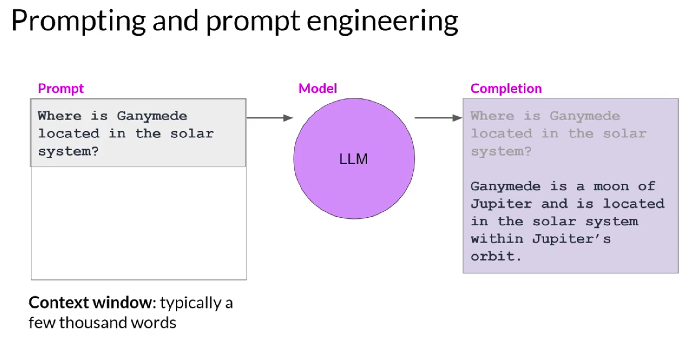
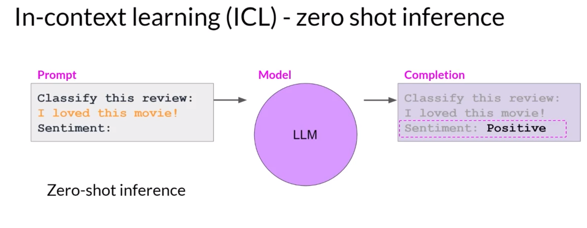
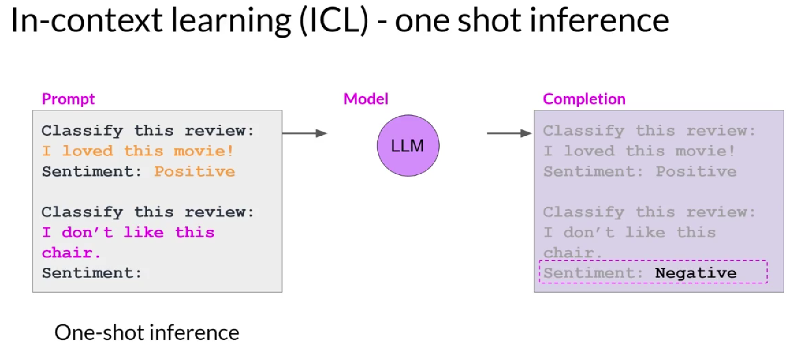
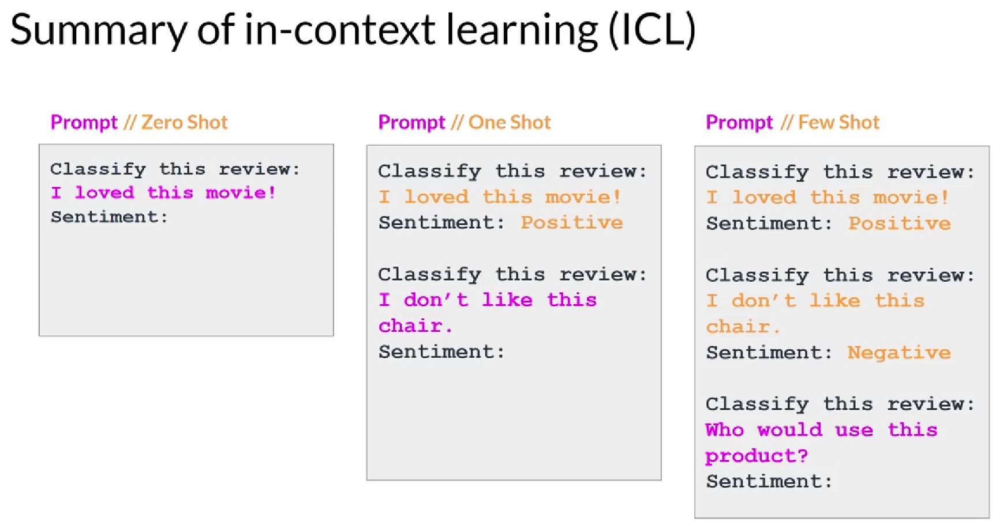

## What is prompting & prompt-engineering?

**Prompts** involve instructions and context passed to a language model to achieve a desired task

**Prompt engineering** is the practice of developing and optimizing prompts to efficiently use language models (LMs) for a variety of applications

## What is In-context learning?
With In-context learning, you can help LLMs learn more about the task being asked by including examples or additional data in the prompt

