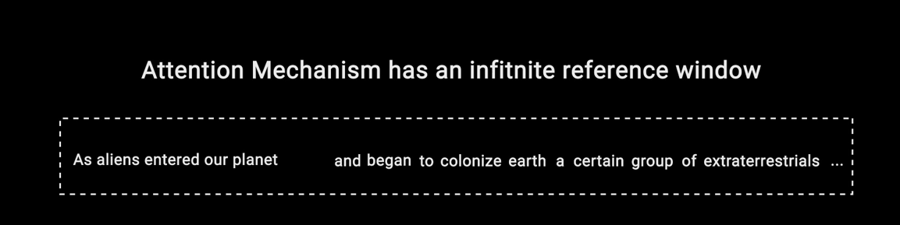

# Types of transformer models

1. **Encoder only(Auto-encoding)**:
    Encoder models use only the encoder of a Transformer model. At each stage, the attention layers **can access all the words in the initial sentence**.

    **Objective**: The pretraining of these models usually revolves around somehow corrupting a given sentence (for instance, by masking random words in it) and tasking the model with finding or reconstructing the initial sentence.

    |Original text|The|teacher|teaches|the|student|
    |:-----|:--- |:------- |:------ |:--- |:------- |
    |MLM(Masked Language modeling)|The|teacher|\<mask>|the|student|
    |Reconstruct text(denoise)|The|teacher|teaches|the|student|
    |Bidirectional context|---|----->|teaches|<--|-------|

    **Use-cases**: 
    - Sentiment Analysis
    - Named Entity Recognition
    - Word Classification
    
    **Models**:
    - BERT
    - DistilBERT
    - RoBERTa
----
2. **Encoder-Decoder(Sequence to Sequence)**:
    Encoder-decoder models (also called sequence-to-sequence models) use both parts of the Transformer architecture. At each stage, the attention layers of the encoder can access all the words in the initial sentence, whereas the attention layers of the **_decoder_ can only access the words positioned before a given word in the input**.

    **Objective**: T5 is pretrained by replacing random spans of text (that can contain several words) with a single mask special word, and the objective is then to predict the text that this mask word replaces.

    |\|The|teacher|\<mask>|\<mask>|student|
    |:-----|:--- |:------- |:------ |:--- |:------- |
    |Sentinel token(mask words)|The|teacher|\<x>||student|
    |Reconstruct span|The|teacher|\<teaches>|\<the>|student|

    **Use-cases**:
    - Translation
    - Text Summarization
    - generative question answering

    **Models**:
    - BART
    - T
----
3. **Decoder only(autoregressive models)**:

    Decoder models use only the decoder of a Transformer model. At each stage, for a given word the **attention layers can only access the words positioned before it in the sentence**. These models are often called auto-regressive models.

    **Objective**:
    The pretraining of decoder models usually revolves around **predicting the next word** in the sentence.

    |Original text|The|teacher|teaches|the|student|
    |:-----|:--- |:------- |:------ |:--- |:------- |
    |Causal Language Modeling|The|teacher|?|?|?|
    |Predict Next word|The|teacher|_teaches_|_the_|_student_|
    |Unidirectional context|---|------|---->

    **Use-Cases**:
    - Text generation

    **Models**:
    - GPT
    - GPT2
    - BLOOM
    - BARD
    - CLAUDE
    - PaLM
    - LLAMA,LLAMA2

----
# History(Evolution tree) of LLM models

 The evolutionary tree of modern LLMs traces the development of language models in recent years and highlights some of the
most well-known models. Models on the same branch have closer relationships. 

Transformer-based models are shown in non-grey
colors: **decoder-only models in the blue** branch, **encoder-only models in the pink** branch, and **encoder-decoder models in the green**
branch. 

The vertical position of the models on the timeline represents their release dates. Open-source models are represented by
solid squares, while closed-source models are represented by hollow ones.

To view the animated view of [evolution tree click here](https://view.officeapps.live.com/op/view.aspx?src=https%3A%2F%2Fraw.githubusercontent.com%2FMooler0410%2FLLMsPracticalGuide%2Fmain%2Fsource%2Ffigure_gif.pptx&wdOrigin=BROWSELINK)

The stacked bar plot in the bottom right corner shows the
number of models from various companies and institutions.

For more details you can refer to this [link](https://arxiv.org/pdf/2304.13712v2.pdf)

[Data-Centric AI](https://towardsdatascience.com/what-are-the-data-centric-ai-concepts-behind-gpt-models-a590071bb727) concepts behind GPT models

<!--
## Encoder Layer 

## Decoder Layer -->

<!-- 

# Attention mechanism

Text Generation Transformer

Let's give a input text as "**As aliens entered our planets**"

and it generated output as
"**As aliens entered our planets  in  search of resources for their home planet , we started having  the first contact with them. And we learned that they're intelligent and capable of complex and intricate communication and planning.**" -->

Try GPT-2 Transformer out on your own at live this url
https://transformer.huggingface.co/doc/gpt2-large

<!-- 
 -->

# Transformer model architecture from Scratch 

Let's Try Transformer model from scratch [here](../transformers-details/transformers_scratch.ipynb)
